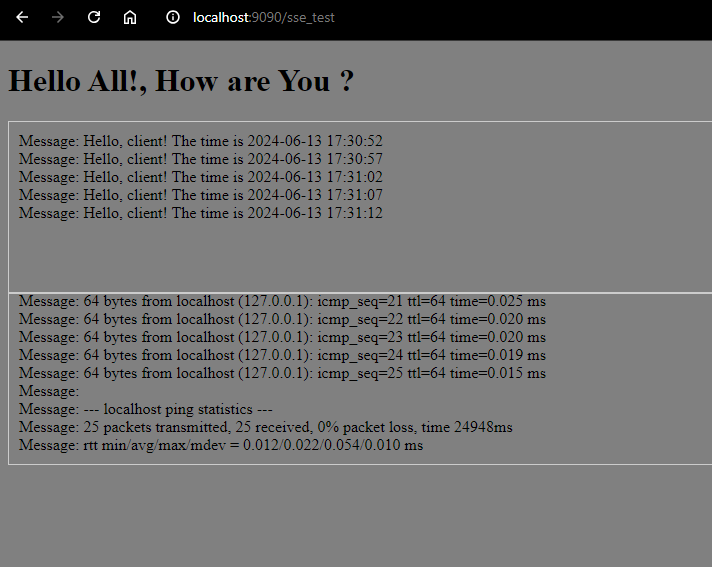

# CrudeOil
## Example 2
### Description
This example will help us understand how to setup SSE in CrudeOil.

### Installation
```bash
pip install crudeoil
```
### Run Example
```bash
python serv.py
```
### Browser View

