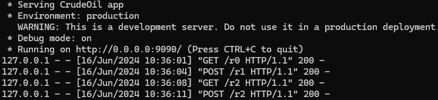
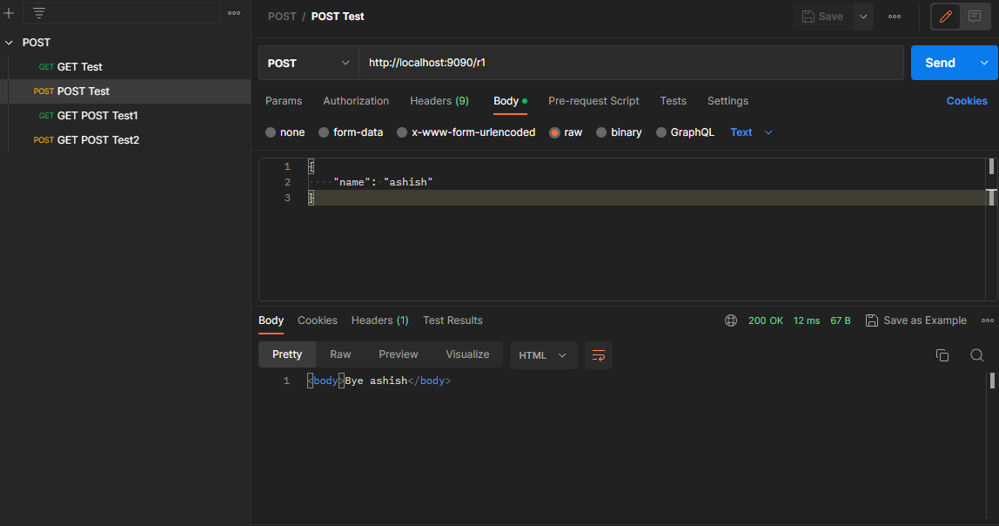
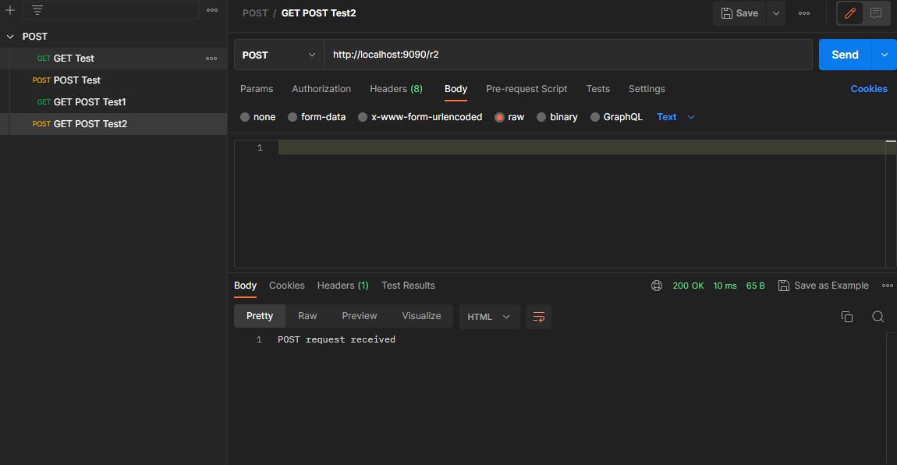

# CrudeOil
## Example 3
### Description
This example will help us understand how to utilize request object to get request args, body, headers etc.

### Installation
```bash
pip install crudeoil
```
### Run Example
```bash
python serv.py
```
### CLI Server Logs


### GET Request


### POST Request


### GET Request with conditions


### POST Request with conditions

